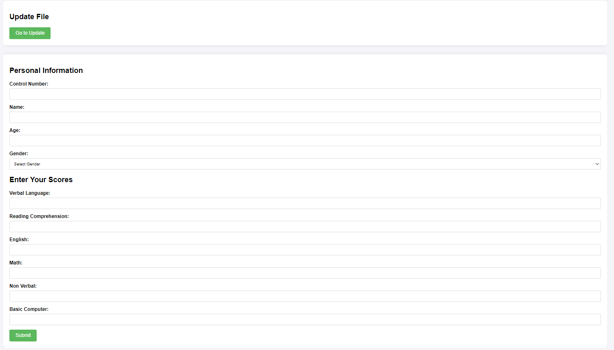
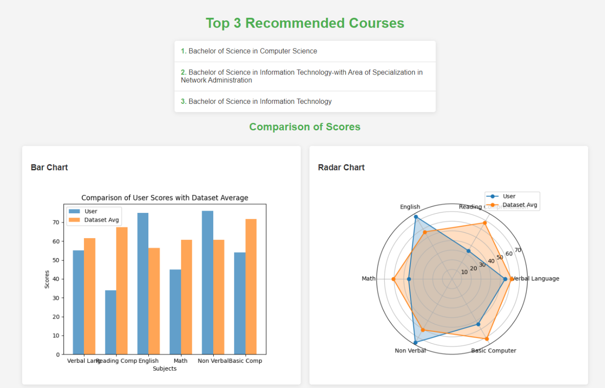

# Course Recommendation System

**A Browser Extension for Senior High School Students**

- **Started:** Jan 11 2024  
- **Submitted:** November 4 2024

## Project Overview

The Course Recommendation System is a browser extension designed to help Senior High School students find courses that best match their strengths and interests. This system utilizes content-based filtering techniques, leveraging both Pearson and Cosine similarity algorithms, to recommend programs tailored to individual user profiles.

The project includes visual representations and insights, making the recommendations easy to understand and relevant to students preparing for their college education.

## Features

- **Personalized Course Recommendations**: Uses Pearson and Cosine similarity to match students with suitable courses based on their scores.
- **Likert Scale Inputs**: Collects user input through a structured Likert scale, making the process interactive and accurate.
- **Evaluation Metrics**: Assessed with RMSE (Root Mean Square Error) and MAE (Mean Absolute Error) for accuracy.
- **Intuitive User Interface**: Designed to be accessible and straightforward for high school students.
  
## Data and Methodology

- **Data Collection**: Historical data on students’ aptitudes and course preferences.
- **Processing**: Preprocessed data includes verbal, reading comprehension, English, math, non-verbal, and computer skills scores.
- **Recommendation Algorithm**: Content-based filtering implemented with Pandas, Scikit-learn, and Flask to calculate similarity scores and suggest courses.

## Screenshots

### Main Interface

### Recommendations

## Technologies Used

- **Languages**: Python, HTML, CSS, JavaScript
- **Libraries**: Flask, Pandas, Scikit-learn
- **Database**: MySQL and PostgreSQL for storing user profiles and recommendation data

## Team Members

- **Santos, Nicolai Isaiah C**
- **Prin, Kristine**
- **Pamintuan, Ralph**
- **Opeda, Francis**

---

## How to Use

1. **Install the Extension**: Download and install the browser extension from the provided link.
2. **Provide Input**: Complete the Likert scale survey based on your skills and interests.
3. **View Recommendations**: Receive personalized course recommendations and explore suggested options.

## Future Improvements

- **Machine Learning Model Optimization**: Enhance recommendation accuracy by fine-tuning similarity thresholds.
- **Additional Features**: Incorporate more input fields and other metrics to improve recommendation relevance.

---

